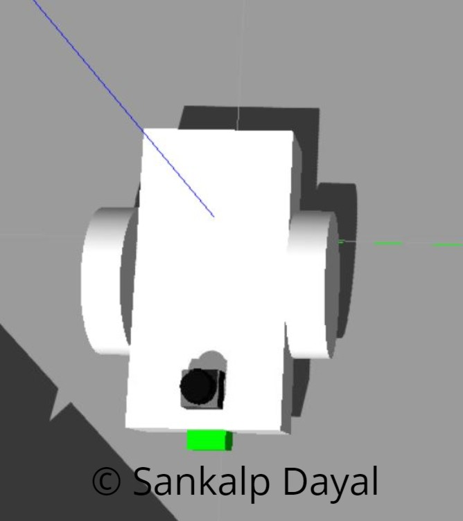
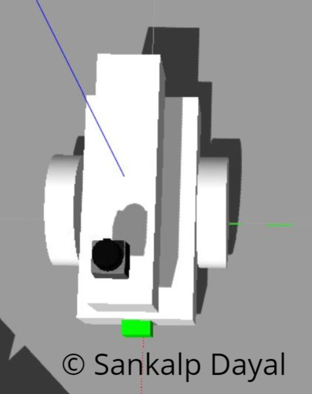
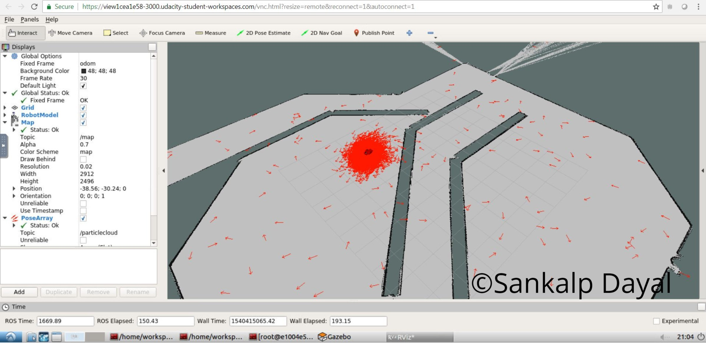
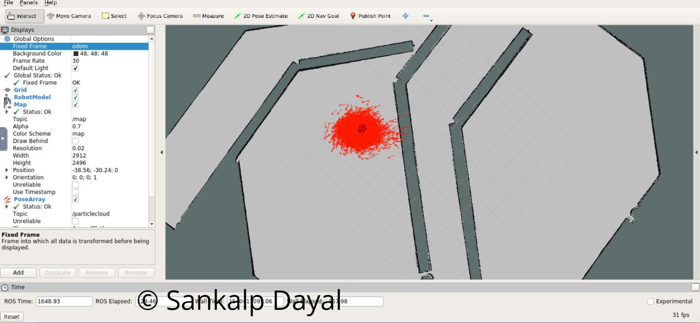

# Where Am I
The goal of this project is to localize a robot in  Gazebo environment using AMLC (Adaptive Monte Carlo Localization) method. Further more 
for localization, a custom robot needs to be created built upon existing provided robot. 

### Abstract
The project is based on concepts of building robot model using Unified Robot Description Format
(URDF). The environment to simluate the robot is based on Gazebo inside a static map.
Within this environment the robot is localizing the robot using sensors simulated using plugins. 
The robot is controlled using actuators plugins .
ROS Navigation stack is used to navigate a robot towards the specified goal using
this static map. For localization, ACML (Adaptive Monte Carlo
Localization) algorithm was used. To obtain the best performance the parameters of this algorithm are tuned. 
This report is aimed to describe these steps in more detail. 

### Introduction
For any robotics application the development of algorithms for perception and acutation is iterative process. 
Since it is very difficult to do it in real robot, the best strategy is to simulate all the aspects including environment, robot,
sensors and control. For this existing methods and simualtors exist which simulate the robot, its inertial aspects, simulate environment,
simulate actuation and sensors including errors. The robot creation method is standardized using URDF model that describes the elements,
their linkages, inertial characterisitics etc. Similarly sensors like camera, laser scanner can also be simulated. Furthermore, this environments also have plugins for standard algorithms for percenption, control, localization etc. In this project, once 
the new robot is created, the next goal is to localize the robot using sensors for which a standard pacakge of ACML is used and tuned. 

Localization are of two types; local and global. 
Local is the concept of determining robot pose and orientation fusing odometery and perception sensors data. 
Global localization is using the local localization and matching it to a global map to place and orient robot with respect to the global map.

### Background
For localization, Monte Carlo Localization algorithms have been very popular. The algorithm is based on sampling mulitple particles 
Because of sampling many particles, these particles can be used to represent any distribution function. This aspect of algorithm
makes it better than Kalman Filter which strongly needs gaussian distributions.
The other good feature of MCL is that its implementation is easier and allows control of memory. This makes it exremely useful algorithms 
for embedded systems which are always resource constrained.

### Custom Robot Design
The custom robot was built upon the provided udacity bot. The udacity bot consists of two wheels and one caster fixed to a square platform.
The udacity bot has two sensors; camera and hokuyo laser. The bot is driven using differential drive controller. The udacity bot is shown here. 
shown here.

This customer robot was further enhanced by adding a layer on top of chassis and shifting the camera on top of this layer. The new robot urdf file is in urdf folder and named 
sd_bot.xacro. The sensor parameters were kept unchanged and are defined in sd_bot.gazebo. To lauch this robot the robot descriptuon launch file was updated. The robot looks like this.

### Configurations
The common parameters were selected values that worked well for two robots simultaneously.
1. Transform tolrence was set to 0.3
2. Inflation radius was set to 0.3 to match the robot shape.

For local costmap parameters, the size of the map was lowered to assist movement specially when robot tried to cross the wall.
1. Widht was changed to 5
2. Height was changed to 5.

Goal tolrence parameters were also set in base local planner params to assist when the robot racahes the goal.
1. yaw goal tolerance was set to 0.04
2. xy goal tolerance was set to 0.15

### Results 
For launching of udacity bot the default launch file `robot_description.launch` is used. For the launch of custom bot
another launch file was created `robot_sd_description.launch`. Since same parameters are used for both the bots, the acml.launch file remained the same.

The results for the udacity robot navigation are shown in the following image.

The results for the custom robot navigation are shown in the following image.

### Discussion
1. This kind of localization technique can be used for the robot with the known map 
However, this may not work properly with moving people and objects. Hence this will need a mapping technique as well.
2. Becaus of so much compuation a better method to give more visilbity on resources consumption is required.

### Future Work
1. Improvement can be done by adding more sensors. This can be same type like laser but at a different location
or can be new type like depth sensor.
2. Custom maps can be created to see how the robot performs in terms of localization in different maps and the limitations 
of the techniques can be well understood.
3. The configurations still have scope of improvement.